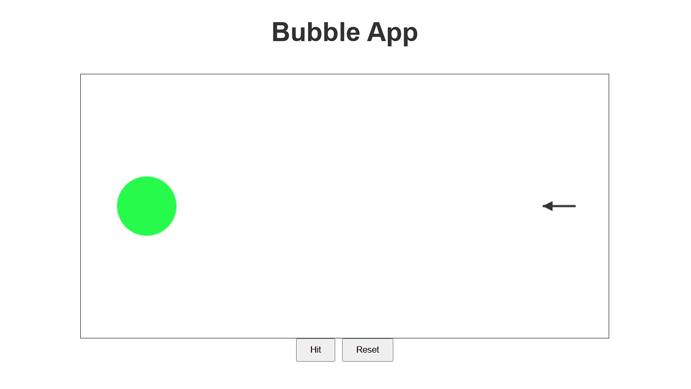

# Bubbles App

## Description
Bubbles App is a simple web application built using HTML, CSS, and JavaScript (without any third-party libraries). It features basic canvas animations where a circle and an arrow interact upon user input.

## Features
- A circle is drawn on the left side of the canvas, filled with a randomly generated color.
- An arrow is positioned on the right side of the canvas.
- Clicking the **Hit** button initiates the arrow's movement toward the circle.
- Upon collision, the circle changes color.
- Clicking the **Reset** button restores the application to its initial state.

## Technologies Used
- **HTML5 Canvas** for rendering graphics.
- **JavaScript (Vanilla JS)** for logic and animations.
- **CSS** for basic styling.

